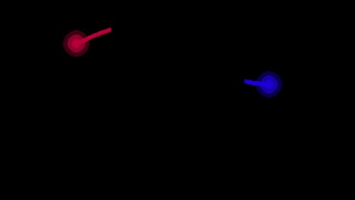
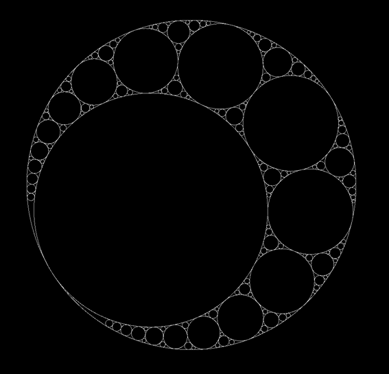

# Meus Projetos de Programação

Bem-vindo ao repositório dos meus projetos de programação do dia a dia! Este repositório contém diversos projetos que desenvolvi utilizando as bibliotecas `pygame` e `p5`. Cada projeto está organizado em pastas separadas, facilitando a navegação e a compreensão do código.

## Índice

- [Visão Geral](#visão-geral)
- [Projetos](#projetos)
- [Como Executar](#como-executar)
- [Pré-requisitos](#pré-requisitos)
- [Instalação](#instalação)

## Visão Geral

Este repositório é uma coleção dos meus projetos pessoais de programação. O objetivo é compartilhar meu progresso, aprendizado e fornecer exemplos de como utilizar as bibliotecas `pygame` e `p5` para criar aplicações interativas e jogos.

Essas são algumas das pessoas que me inspiraram a criar esses projetos:

<p align="center">
    <a href="https://www.youtube.com/c/TheCodingTrain">
        
    </a>
    <a href="https://www.youtube.com/c/ClearCode">
        
    </a>
    <a href="https://www.youtube.com/@cartersemrad">
        
    </a>
    <a href="https://www.youtube.com/c/SebastianLague">
        
    </a>
</p>

<p align="center">
    <a href="https://www.youtube.com/@TheCodingTrain">The Coding Train</a> &nbsp;|&nbsp;
    <a href="https://www.youtube.com/@ClearCode">Clear Code</a> &nbsp;|&nbsp;
    <a href="https://www.youtube.com/@cartersemrad">Carter Semrad</a> &nbsp;|&nbsp;
    <a href="https://www.youtube.com/@SebastianLague">Sebastian Lague</a>
</p>

## Projetos

### 1. Projetos com Pygame



### 2. Projetos com P5



## Como Executar

Para executar qualquer um dos projetos, siga os passos abaixo:

1. Clone este repositório:
    ```bash
    https://github.com/gabriellsar/coding-challenges.git
    ```

2. Navegue até a pasta do projeto desejado:
    ```bash
    cd nome-do-projeto
    ```

3. Crie e ative um ambiente virtual (venv):
    ```bash
    python -m venv venv
    ```

    - No Windows:
        ```bash
        venv\Scripts\activate
        ```

    - No macOS/Linux:
        ```bash
        source venv/bin/activate
        ```

4. Execute o projeto:
    ```bash
    python main.py
    ```

## Pré-requisitos

Certifique-se de ter os seguintes pré-requisitos instalados:

- Python 3.10.11 ou maior
- Pip (gerenciador de pacotes do Python)

## Instalação

Instale as dependências necessárias para cada projeto. As bibliotecas principais utilizadas são `pygame-ce` e `p5`. Você pode instalá-las usando os comandos abaixo:

### Pygame

```bash
pip install pygame-ce
```

### p5

```bash
pip install p5
```
